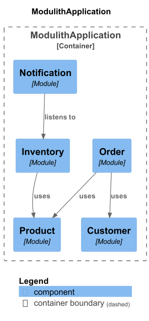
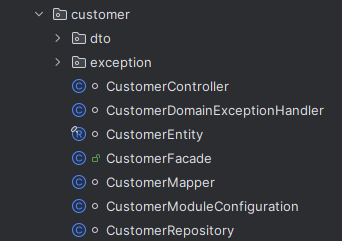
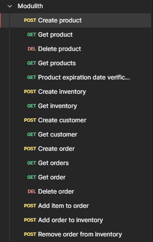

# Modular monolith

1. [Introduction](#introduction)
2. [Technology stack](#technology-stack)
3. [Architecture overview](#architecture-overview)
5. [How to run](#how-to-run)

## Introduction

Application that mimics the behavior of an e-commerce application. 
The main goal of this project was to create a system in *Modular Monolith* architecture.
Due to the fact that I am an architecturally curious developer, I decided to use *Modular Monolith* architecture.

## Technology stack

* Spring Boot
* Spring Modulith
* Java
* Gradle
* JUnit
* AssertJ

## Architecture overview

The application consists of the 5 modules:

* Customer
* Inventory
* Notification
* Order
* Product

Mostly, the modules communicate using public *API* exposed by module entry point called *Facade*.
The exception is the *Notification* module which listens to events from *Inventory* module.
Communication is defined in asynchronous way thanks to *Spring's* built-in *Event Bus*.

Architecture diagram generated by *Spring Modulith*:

Each module has similar structure:

The module has a public *API* defined in the module as an entry point called *Facade*. 
Other classes are package-private and are used only inside the module.
*Dto's*, *exceptions* and *events* (*Inventory* module) are also public due to the fact that they are used to inform / interact with other modules. 
I've placed them into sub-packages so that when you enter such a module, only one public class is visible.

What are the benefits of this approach?
* One public class makes it clear, where the entry point is.
* Less to put into your head (more to safely ignore).
* Easier to test (you can focus only on public class if you want).
* Easier to refactor, move, move out, or throw away.
* Simple blocks, with simple *API's*.
* Easier to understand the whole architecture (points of contact - facade from one module uses another facade from another module).

## How to run

Just open the project in your favorite *IDE* and run it.
No database is needed, everything is in-memory.
Moreover, I provide *Postman* collection that you can use to test the application.

